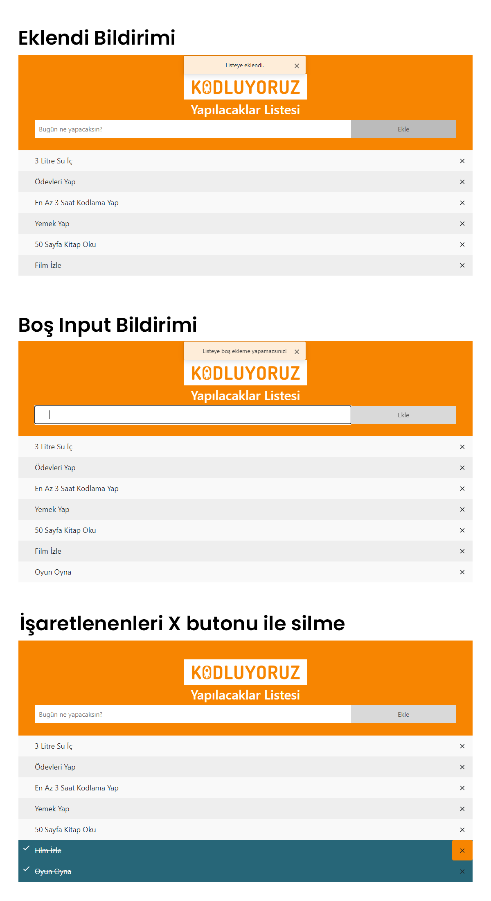

# Javascript | Ödev-2

### Kodluyoruz Front-End Eğitimindeki Javascript bölümünün ikinci ödevi

### Javascript ile To Do List

* LocalStorage kullanılmıştır.

[Çağrı Erdem | Patika.dev Profilim](https://app.patika.dev/cagrierdem)

Önizleme:

